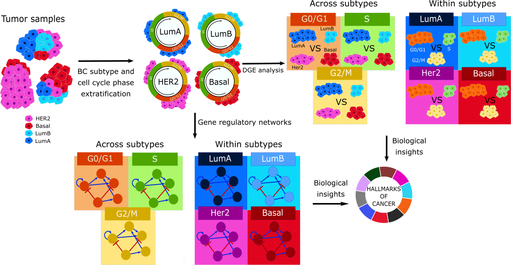

# Decoding Cell Cycle Phase Variations in Cancer Hallmarks Across Breast Cancer Subgroups

This study leverages single-cell transcriptomics to explore breast tumor heterogeneity. By analyzing both tumor subtypes and cell cycle phases, it uncovers additional cancer hallmark pathways and identifies FDA-approved drugs that target specific phase-subtype combinations. These insights suggest that integrating cell cycle phase information could lead to more precise and effective therapeutic strategies in breast cancer treatment.


<p align="center">
  
</p>

## Repository Overview

This repository provides the resources and scripts to:

- Clean and process the data of two breast cancer atlases.
- Infer the cell type and the single cell PAM50 subtypes.
- Conduct differential gene expression analysis.
- Infer gene regulatory networks (GRNs) and regulons.
- Perform pathway enrichment analysis.
- Analyze drug databases (DrugBank and CTD) for potential drugs of interest.
- Different plots to visualize the results.

---

## Data

The project uses the following datasets:

- **Discovery Dataset**: [Single-cell transcriptomic analysis of breast cancer](https://www.nature.com/articles/s41588-021-00911-1)
- **Validation Dataset**: [Integrative single-cell analysis of transcriptional and epigenetic states in the human adult brain](https://pubmed.ncbi.nlm.nih.gov/33950524/)

## Scripts Overview

### R Scripts:

**Data preparation:**

1. **data_generation_discovery.R**: Prepares discovery data for breast cancer analysis, including data normalization, feature selection, and cell cycle phase inference.

2. **data_generation_validation.R**: Prepares discovery data for breast cancer analysis, including data normalization, feature selection, and cell cycle phase inference.

3. **common_genes.R**: Shared genes between discovery and validation datasets.

4. **singleR_training_celltype.R**: Analyzes the performance of the cell type inference algorithm.

5. **singleR_validation.R**: Infers the cell types.

6. **sc_subtyping_discovery.R**: Identifies molecular subtypes within single-cell data in the discovery dataset.

7. **sc_subtyping_validation.R**: Identifies molecular subtypes within single-cell data in the validation dataset.

**Differential Gene Expression (DGE):**

1. **DGE_analysis.R**: Performs differential expression analysis on single-cell RNA-seq data using limma and FGSEA.

2. **intersection.R**: Provides intersectional results between discovery and validation datasets.

3. **DGE_figure3a.R**: Plots Figure 3A.

4. **DGE_figure3b.R**: Plots Figure 3B.

5. **DGE_figure3c.R**: Plots Figure 3C.

**Gene Regulatory Networks (GRN):**

1. **GRN_analysis.ipynb**: Single-Cell Gene Regulatory Network Analysis – SCENIC Pipeline. Infers GRNs and regulons across different BC subtypes and cell cycle phases, and computes AUCell and RSS for each regulon.

2. **regulon_analysis.R**: Processes SCENIC results, computes AUCell and RSS, and performs pathway enrichment analysis.

3. **regulon_analysis_nophase.R**: Processes SCENIC results, computes AUCell and RSS, and performs pathway enrichment analysis when cell cycle phases are not considered.

4. **intersection.R**: Provides intersectional results between discovery and validation datasets.

5. **GRN_figure4a.R**: Plots Figure 4A.

6. **GRN_figure4b.R**: Plots Figure 4B.

7. **GRN_figure4c.R**: Plots Figure 4C.

7. **GRN_figure5.R**: Plots Figure 5.


---

## Getting Started

This project uses two Conda environments:

1. **R environment**: For data preparation, single cell PAM50, cell type inference, DGE analysis, Pathway analysis, regulon analysis and drug analysis.

2. **Python environment**: For GRN inference, regulon inference and regulon analysis.


---

### Setting Up the R Environment

A file named R_environment.yaml is provided in the repository root. This file specifies the required packages and their versions. To create the environment, open your terminal (or Anaconda Prompt), navigate to the repository directory, and run:

#### Steps to Set Up

1. **Create the R Environment**  
   Run the following commands:
   ```bash
   conda create -n SC_analysis_R_env r-base r-essentials -c conda-forge
   conda activate SC_analysis_R_env
   ```

2. **Install R Packages**  
   With the environment activated, launch R and run:
   ```bash
   R
   source("install_packages.R")
   ```

3. **Launch RStudio Using a Batch File**  
   Create a batch file (e.g., `launch_rstudio.bat`) with the following content:
   ```batch
   @echo off
   call "C:\Users\migcas\AppData\Local\anaconda3\Scripts\activate.bat" SC_analysis_R_env
   start "" "C:\Program Files\RStudio\bin\rstudio.exe"
   ```
   Then run the batch file from the command prompt:
   ```batch
   launch_rstudio.bat
   ```

4. **Change RStudio Global Settings (if necessary)**  
   Once RStudio is open, go to **Tools > Global Options > General > R version**.  
   Click **Change** and select the R executable from your conda environment, typically at:
   ```bash
   C:\Users\migcas\AppData\Local\anaconda3\envs\SC_analysis_R_env\lib\R\bin\R.exe
   ```

It may tell you to restart Rstudio. Then if you run R.home() in Rstudio it should point to your environment.

5. **Project-Specific Configuration (Optional)**  
   For project-specific settings, consider adding a `.Rprofile` in your project directory that points to the correct R interpreter.

---

### Setting Up the Python Environment

A file named python_environment.yaml is provided in the repository root. This file specifies the required packages and their versions. To create the environment, open your terminal (or Anaconda Prompt), navigate to the repository directory, and run:

#### Steps to Set Up

1. **Create the Python Environment**  
   Run the following commands:
   ```bash
   conda env create -f python_environment.yml
   conda activate py_sc_analysis_env
   ```

2. **Register the environment as a Jupyter kernel:**  
 
   ```bash
   python -m ipykernel install --user --name py_sc_analysis_env --display-name "py_sc_analysis_env"
   ```
3. **Launch jupyter notebook/jupyter lab:**  
 
   ```bash
   jupyter notebook
   ```
   ```bash
   jupyter lab
   ```
Then select the py_sc_analysis_env kernel for your notebooks.

---

### Who to Contact

For questions or support:
- **Miguel Castresana Aguirre**  
  Email: [miguel.castresana.aguirre@ki.se](mailto:miguel.castresana.aguirre@ki.se)

---

