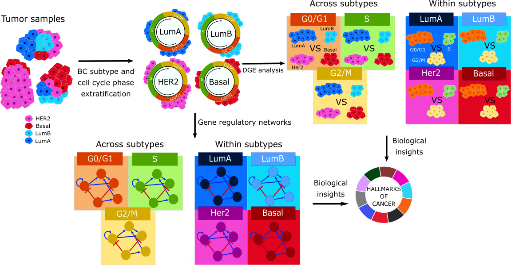

# Decoding Cell Cycle Phase Variations In Breast Cancer

This repository contains the analysis code for studying how cell-cycle phase adds biological resolution to breast cancer single-cell transcriptomic subgroups.

The workflow processes discovery and validation atlases, assigns cell type and PAM50-like subtype labels, performs differential expression and pathway analysis, infers gene regulatory networks, and prioritizes candidate drugs for subtype-phase combinations.

<p align="center">
  
</p>

## Repository Layout

```text
.
├── src/
│   ├── data/          # Data preparation, cell-type inference, and subtype assignment
│   ├── DEG/           # Differential expression, pathway analysis, and figure scripts
│   └── GRN/           # SCENIC/GRN analysis, regulon analysis, and figure scripts
├── docs/              # Data, workflow, and reproducibility notes
├── tools/             # Lightweight repository checks
├── install_packages.R # R package installation helper
├── python_environment.yaml
└── README.md
```

## Main Analysis Stages

1. Prepare discovery and validation single-cell datasets.
2. Infer cell types and single-cell PAM50-like breast cancer subtypes.
3. Compare cell-cycle phase and subtype combinations with differential expression.
4. Run pathway enrichment to identify phase-specific biological programs.
5. Infer gene regulatory networks and regulons with SCENIC.
6. Query drug resources including DrugBank and CTD for candidate therapies.
7. Generate manuscript figures from processed outputs.

See [docs/workflow.md](docs/workflow.md) for the script-level map.

## Data

The repository does not commit raw atlas files or generated analysis outputs. Place external data under a local `data/` or project-specific input directory and update the YAML configs in `src/DEG/` and `src/GRN/` as needed.

See [docs/data.md](docs/data.md) for expected inputs and notes.

## Environments

The project uses separate R and Python environments.

For R:

```bash
conda create -n SC_analysis_R_env r-base r-essentials -c conda-forge
conda activate SC_analysis_R_env
Rscript install_packages.R
```

For Python and SCENIC/GRN notebooks:

```bash
conda env create -f python_environment.yaml
conda activate py_sc_analysis_env
python -m ipykernel install --user --name py_sc_analysis_env --display-name py_sc_analysis_env
```

Then open `src/GRN/GRN_analysis.ipynb` with the `py_sc_analysis_env` kernel.

## Quick Check

Run a lightweight syntax and structure check from the repository root:

```bash
Rscript tools/check-project.R
```

This check parses the R scripts and confirms key files are present. It does not require the private/raw datasets.

## Important Entry Points

| Area | Scripts |
| --- | --- |
| Data preparation | `src/data/data_generation_discovery.R`, `src/data/data_generation_validation.R`, `src/data/common_genes.R` |
| Cell annotation | `src/data/singleR_training_celltype.R`, `src/data/singleR_validation.R` |
| Subtyping | `src/data/sc_subtyping_discovery.R`, `src/data/sc_subtyping_validation.R` |
| Differential expression | `src/DEG/DGE_analysis.R`, `src/DEG/intersection.R` |
| GRN/regulons | `src/GRN/GRN_analysis.ipynb`, `src/GRN/regulon_analysis.R`, `src/GRN/regulon_analysis_nophase.R` |
| Figures | `src/DEG/DE_*figure3.R`, `src/GRN/GRN_figure*.R`, `src/GRN/GRN_figure5.py` |

## Contact

Miguel Castresana Aguirre  
[miguel.castresana.aguirre@ki.se](mailto:miguel.castresana.aguirre@ki.se)
